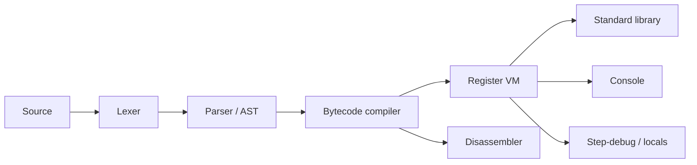

# Lunex

**Browser Lua playground with a real register VM you can inspect — plus an 8-bit CPU companion.**

[](./LICENSE)


> Educational. Not a drop-in replacement for PUC-Rio Lua, Fengari, Wasmoon, or LuaJIT.


**Showcase media:** placeholders in `public/showcase.mp4` / `docs/showcase.gif` — Head SWE will drop the cut. Preferred shot list: open playground → run Tour → AST + bytecode → step locals → flip to `/vm`.

---

## What it is

| Surface | Role |
|---------|------|
| **Lunex Playground** (`/`) | Edit Lua → lex/parse → **bytecode** → **register VM** → console. AST tree, disassembly, step-debug. |
| **Lunex VM** (`/vm`) | 8-bit CPU with assembler + debugger (registers, flags, memory, breakpoints). Bottom-up companion. |

## What it isn’t

- Not production Lua embedding (use Fengari / Wasmoon / host Lua).
- Not faster than LuaJIT — we will never claim that.
- Not a full PUC-Rio conformance suite (own vitest matrix; see gaps).
- Not coroutines-complete; Lua patterns are JS-regex approximations.

---

## Quickstart

```bash
npm install
npm run dev          # playground + /vm
npm test             # vitest
npm run build        # static site → dist/ (GitHub Pages friendly)
npm run preview
```

Open the printed local URL. **Ctrl/Cmd+Enter** runs (playground) or assembles (CPU page).

Share snippets: `?code=` (URL-encoded) or `#code=` (base64url).

### GitHub Pages

`vite` `base: './'` → deploy the `dist/` folder (Actions or `gh-pages`). Multi-page: `index.html` + `vm.html`.

---

## Architecture



Pipeline mirrors the PUC-Rio story: **source → bytecode → register machine**, with AST kept as compiler IR. The 8-bit CPU page is intentionally a separate ISA — hardware intuition, not Lua bytecode.

---

## Lua 5.2 gap matrix

Legend: **✓** supported · **◐** partial · **✗** not in this build

| Area | Status | Notes |
|------|--------|-------|
| Lex / long strings `[[ ]]` / long comments | ✓ | |
| Locals, scoping, closures / upvalues | ✓ | |
| Tables, `#`, `setmetatable` / `__index` (table) | ✓ | `__index` function ◐ |
| Numeric / generic `for`, `while`, `repeat` | ✓ | |
| Multi-return, variadics `...` | ✓ | edge cases ◐ |
| `pcall` / `error` / `assert` | ✓ | |
| `math` / `string` / `table` / `os.clock` | ✓ | |
| Bytecode dump + VM step | ✓ | |
| `goto` / labels | ✗ | tractable later |
| Full metamethod set (`__add`, `__call`, …) | ◐ | `__index` primary |
| Coroutines | ✗ | stretch |
| Lua patterns | ◐ | JS `RegExp` stand-in |
| `_ENV` / Lua 5.2 env model | ◐ | globals table only |
| Integers / bitwise / `utf8` (5.3) | ✗ | selective later |
| Official `lua-tests` suite | ◐ | not vendored; own vitest |

---

## Why not Fengari / Wasmoon / LuaJIT?

| | Lunex | Fengari | Wasmoon | LuaJIT |
|--|-------|---------|---------|--------|
| Goal | Teach bytecode + VM in-browser | Run PUC Lua in JS | WASM Lua | Native speed |
| Inspectable bytecode / step | First-class | Limited | Limited | Native tools |
| 8-bit CPU companion | Yes | No | No | No |
| Conformance | Educational 5.2 core | High | High | High |
| Performance claim | None vs LuaJIT | — | — | King |

Use Lunex to **see** the machine. Use the others to **ship**.

---

## Tests

```bash
npm test
```

Vitest covers lexer (incl. long strings), parser smoke, and VM semantics: arithmetic, closures, numeric `for`, metatable Stack, `pcall`, `table.sort`/`concat`, disassembly. Honest status: **not** the official Lua test suite.

---

## Layout

```
src/lua/     lexer, parser, bytecode, compiler, vm, stdlib, public API
src/playground/  CodeMirror UI, demos, share, inspector
src/vm/      8-bit assembler + CPU + debugger UI
tests/       vitest
```

---

## License

MIT © 2026 aevum
